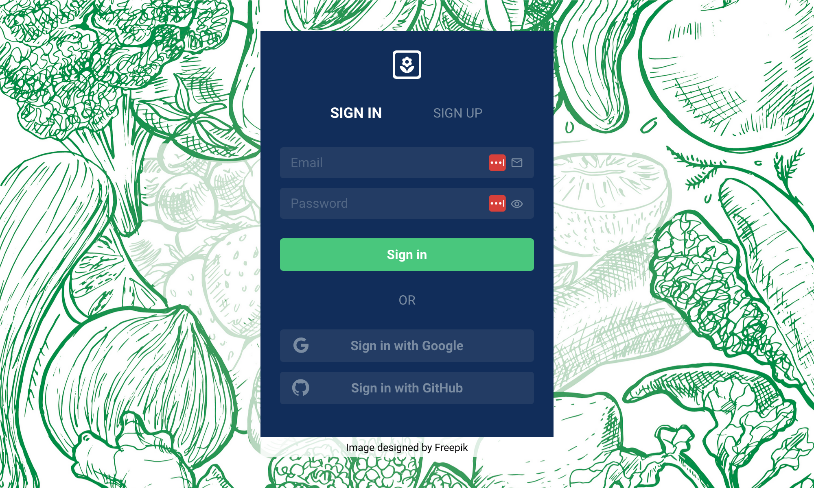
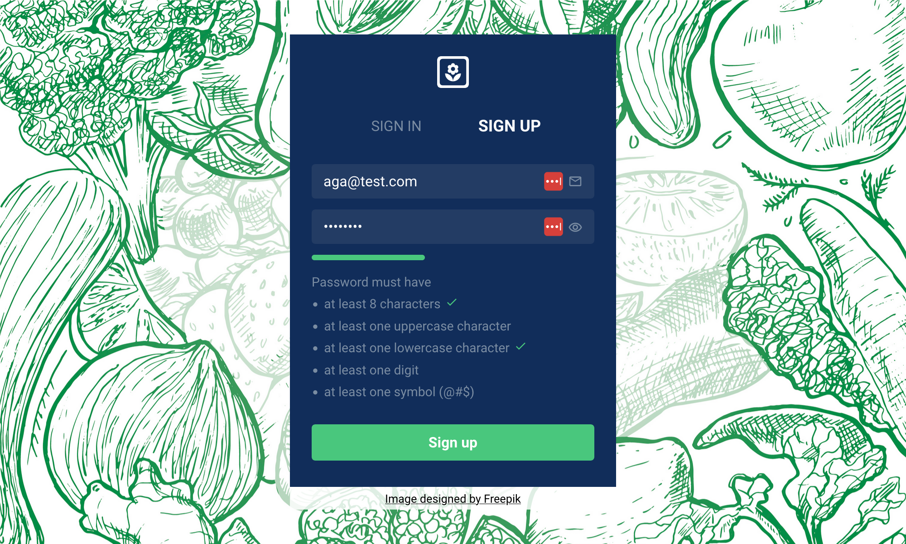
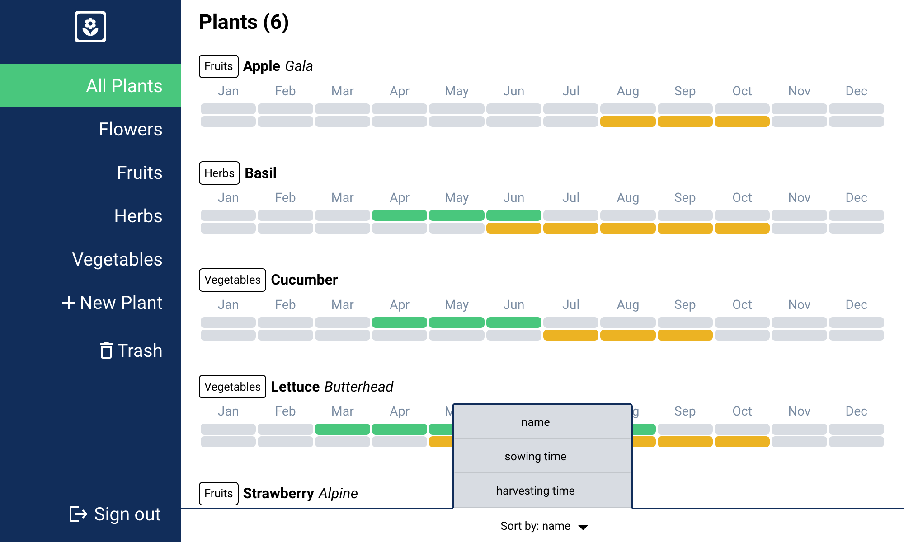
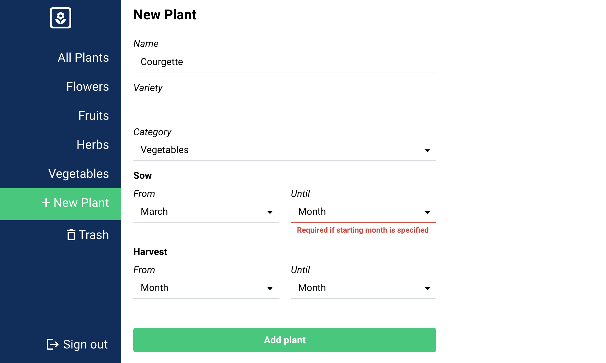
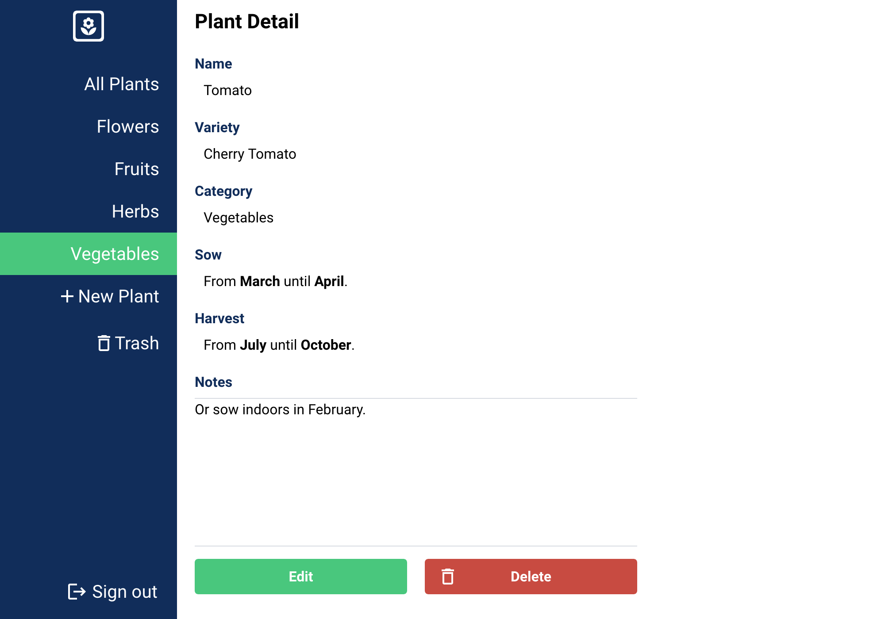
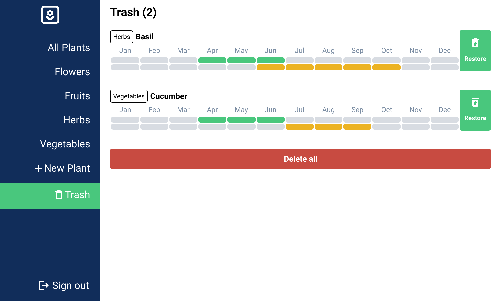

# Gardening Calendar

## Features

### Authentication

Users can securely sign up and sign in to the application using Firebase Authentication. Supported methods:

- Sign up with email and password and receive verification email.
- Sign in with email and password upon successful email verification.
- Sign in with Google account.
- Sign in with GitHub account.

### Plants API (RESTful)

- Authenticated users are allowed to access the Plants API routes.
- Authenticated users can:
  - view their plant collection,
  - add new plants,
  - edit existing plants,
  - move plants to trash,
  - restore plants from trash, and
  - delete plants from trash.

### UI / Dashboard

#### Sign in & Sign up

Features:

- client-side form validation,
- error handling,
- password strength validator
- show/ hide password functionality

#### Plants

- See all plants
- Sort plants by name, sowing or harvesting time
- View plants by category

#### New plant

- add new plant with client-side validation
- redirect to plant detail upon success

#### Plant detail

- view plant details
- edit plant details
- delete the plant

#### Trash

- restore individual plants
- delete all plants

## Tech Stack

- [Next.js](https://nextjs.org/) - the [React](https://react.dev/) framework for the web that provides server-side rendering, automatic code splitting, and easy configuration for building performant web applications. Bootstrapped with [create-next-app](https://github.com/vercel/next.js/tree/canary/packages/create-next-app).
- [Typescript](https://www.npmjs.com/package/typescript) - a typed version of JavaScript that improves code quality and maintenance
- [Redux](https://redux.js.org/) - a state management library for JavaScript applications
- [Redux Toolkit](https://redux-toolkit.js.org/) - an official opinionated package that simplifies the use of Redux
- [Firebase](https://firebase.google.com/) - an application development platform that provides backend services, authentication, cloud storage, hosting, and more
- [Firebase Admin SDK](https://firebase.google.com/docs/admin/setup) - a set of server libraries that lets you interact with Firebase from privileged environments
- [MongoDB](https://www.mongodb.com/) - open-source NoSQL database that is well-suited for storing data in JSON-like documents
- [Mongoose](https://mongoosejs.com/) - an object data modeling (ODM) library for MongoDB

## Architecture

The app uses Next.js' Pages Router and it implements a feature-based folder structure.

The Plants API is developed with Next.js API Routes and the data is stored in the MongoDB database.

Data fetching is done client-side, as the data is private and user-specific.

Using Redux for data fetching provides a centralized and efficient approach to manage and cache data, improving performance and facilitating state management across the application.

The authentication is also implemented client-side, so that the authentication state can persist across multiple page requests without requiring the user to log in again.
